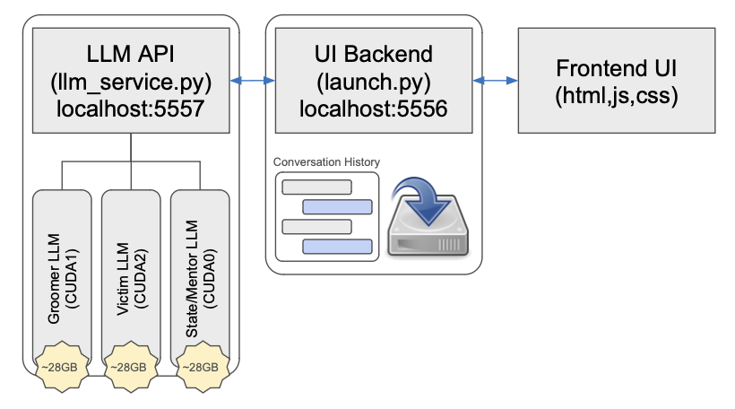

# RCSAC-Interface


The interface is made up of 3 components:
1. The frontend UI
2. The Web App Backend
3. The LLM Backend

## Frontend UI
The code for this can be found in index.html, as well as in the /static/ folder.

## Web App Backend
This code is run via:

```bash
python launch.py
```

This function launches the Backend server, hosting the app at localhost:5556.
This backend manages the conversation history, the communication to the LLM backend, and any saving operations.

## LLM Backend
The reason that this backend exists, is that the Web App Backend runs multiple instances, servicing each UI that is connected. 
If the LLMs lived on that server, it would duplicate the resources. For this reason, this llm backend exists to host the models
that the Web App Backend can communicate with.

This code is run via:
```bash
CUDA_VISIBLE_DEVICES=0,1,3 python llm_service.py
```

You must ensure that 3 GPUs are available, as each LLM requires ~28GB each. The conversation classes can be found in `gen_profiles.py`.

## Usage
As described in each of the above sections, you will first need to use the command to start the `llm_service.py`. Once this service is successully launched and has begun listening, you can now start the `launch.py` backend in a new terminal. Once both of these backends are concurrently running, you should be able to access the index.html UI by going to `localhost:5556/`.